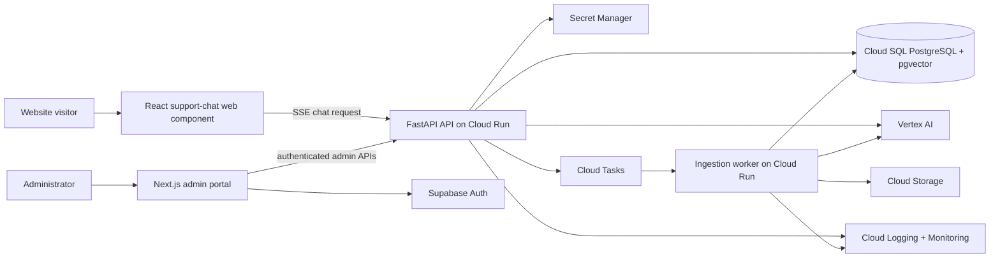

# Architecture: Production RAG Support Chatbot

## Purpose and delivery strategy

This document translates [the product brief](product-brief.md) into an implementation architecture. The system is a single-organization, public support chatbot. It must answer only from a curated knowledge base, stream answers with citations, and let administrators replace content without leaving stale chunks behind.

Delivery begins with a deliberately narrow, production-shaped vertical slice:

- Admin authentication, Markdown/TXT upload, generation plus embeddings, vector retrieval, cited/abstained streamed answer, and a script-loaded widget.
- Real Vertex AI calls in a non-production GCP project.
- A Terraform-managed development environment using Cloud Run, Cloud SQL, and Cloud Storage.
- Query rewriting, lexical retrieval, reranking, PDF/URL ingestion, and provider experimentation follow only after a baseline evaluation set exists.

## Architectural principles

- **Grounded by default:** generation receives approved retrieved context only; insufficient evidence produces an abstention and support handoff.
- **Versioned data:** sources, chunks, model profiles, evaluations, and promotions are all auditable versions.
- **Safe experimentation:** drafts are evaluated before promotion; embeddings never switch production retrieval until re-index and evaluation complete.
- **Managed operations:** Cloud Run, Cloud SQL, Cloud Storage, Cloud Tasks, Secret Manager, and managed observability minimize infrastructure ownership.
- **Provider isolation:** provider adapters hide SDK/API differences from retrieval and chat orchestration.
- **Small deployable units:** API, admin portal, widget, and worker can be built, tested, and deployed independently.

## System context

## Repository and deployment boundaries

Use a monorepo with clear runtime boundaries. Names below are target locations, not existing code.

| Area | Responsibility | Deployment unit |
| --- | --- | --- |
| `apps/api` | FastAPI public chat and authenticated admin APIs | Cloud Run API service |
| `apps/worker` | asynchronous parsing, chunking, embedding, and re-index jobs | Cloud Run worker service |
| `apps/admin` | Next.js/React administration portal | Cloud Run admin service |
| `packages/widget` | React custom element and its Shadow DOM styles | versioned CDN asset |
| `packages/contracts` | request/response schemas, SSE event types, provider capabilities | published workspace package |
| `infra/terraform` | GCP projects, service accounts, Cloud Run, Cloud SQL, Storage, Tasks, secrets, DNS/CDN | Terraform state per environment |

The API owns public and admin request validation. The worker owns ingestion state transitions. The widget never calls providers, databases, or admin endpoints directly.

## Runtime components

### API service

FastAPI exposes `POST /v1/chat/stream` and authenticated `/admin/*` endpoints. It resolves the active model profile, validates the caller, builds a bounded retrieval context, streams Server-Sent Events, and records an immutable trace. It must use async I/O and pooled database connections.

### Ingestion worker

Cloud Tasks invokes an authenticated worker endpoint with a source-version job ID. The worker obtains raw content from Cloud Storage or the approved URL, extracts text, chunks it, embeds it, and writes data using explicit state transitions. Jobs are idempotent by source version and bounded-retry; a failure leaves the preceding active version searchable.

### Admin portal

Next.js uses Supabase email/password authentication and passes verified user identity to the API. One admin role exists in v1. The portal is a control plane, not a data path: source management, job status, model profiles, evaluations, and traces are read or changed through authenticated API routes.

### Widget

The widget is a versioned JavaScript bundle registering `<support-chat>`. It renders in Shadow DOM so host-site CSS cannot break it. The widget submits its public `widget-key`, browser origin, visitor session ID, short history, and question; it consumes named SSE events for answer text, citations, abstention, and completion.

## Data model

Cloud SQL PostgreSQL is the system of record. pgvector serves initial dense retrieval and PostgreSQL full-text search serves lexical retrieval in later milestones.

| Entity | Essential fields | Notes |
| --- | --- | --- |
| `admin_user` | `id`, `supabase_user_id`, `created_at` | Single role in v1. |
| `widget` | `id`, public key hash, `allowed_origins`, display config, handoff config | Never expose key material beyond public widget key. |
| `source_document` | stable `doc_id`, type, storage/URL location, tags, active version ID | Represents a logical document across revisions. |
| `source_version` | `id`, `doc_id`, content hash, status, raw object key, error, timestamps | States: queued, processing, indexed, failed, superseded. |
| `chunk` | `id`, version ID, parent ID, text, token count, page/heading, metadata, embedding, full-text column | Chunks only belong to one source version. |
| `ingestion_job` | ID, source version, attempt, state, task metadata, timing/error | Idempotency and retries. |
| `provider_connection` | provider type, region/endpoint, secret reference, capability flags, health | Secret values never persist in this table. |
| `model_profile` | version, status, role-to-provider/model assignments, limits, fallback, change note | Exactly one active production profile. |
| `evaluation_dataset` / `evaluation_case` | prompt, expected/supporting chunks, category | Golden set is versioned. |
| `evaluation_run` | profile ID, dataset ID, metrics, case results, state | Promotion uses a completed run. |
| `conversation` / `message` | visitor session, widget ID, role, content, metadata | Store only approved retention data. |
| `retrieval_trace` | request ID, profile version, candidate IDs/scores, timings, cost, final state | Connects conversations and evaluations to decisions. |
| `audit_event` | actor, action, entity, before/after summary, timestamp | Captures promotions, rollbacks, and sensitive config changes. |

## Core flows

### Chat flow

1. Widget sends `POST /v1/chat/stream` with the public widget key, origin, visitor session, bounded history, and question.
2. API validates schema, origin, widget status, size, and rate limits.
3. API loads the active production profile and retrieves candidate chunks. The first slice uses vector retrieval; later it runs dense and lexical retrieval in parallel, fuses with RRF, and reranks candidates.
4. API selects 3–5 chunks inside the 2,000-token budget, or declares evidence insufficient.
5. API invokes the selected generation adapter and emits SSE events: `answer.delta`, `citation`, `abstention`, `complete`, or `error`.
6. API persists the message and trace without storing secret material.

### Ingestion and replacement flow

1. Admin creates a source/version through the API; file content goes to Cloud Storage with a private object key.
2. API persists a queued source version and enqueues an idempotent Cloud Task.
3. Worker extracts and normalizes content, then creates structure-aware chunks and embeddings.
4. In one controlled activation transaction, worker marks the new version indexed, supersedes the old version, and removes old-version chunks.
5. If extraction or indexing fails, worker marks only the new version failed; the prior indexed version remains active.

### Model experiment and promotion flow

1. Admin creates a provider connection, with credentials saved directly to Secret Manager, or uses Vertex AI service identity.
2. Admin clones production to a draft model profile and changes one or more role assignments.
3. API checks provider capability and connection health; an evaluation job runs the golden set.
4. Portal compares draft and production quality, latency, error rate, and estimated cost.
5. Promotion atomically changes the active production profile and writes an audit event. Rollback selects a prior approved profile.
6. If embeddings changed, a re-index plan and passing evaluation must complete before promotion.

## API contracts

| Endpoint | Caller | Contract |
| --- | --- | --- |
| `POST /v1/chat/stream` | Widget | Validates public access and streams answer/citation/abstention SSE events. |
| `POST /admin/sources` | Admin portal | Creates a file upload or seed-URL source version and returns job state. |
| `POST /admin/sources/{doc_id}/reingest` | Admin portal | Creates a replacement version; never appends to the current one. |
| `GET /admin/ingestion-jobs` | Admin portal | Lists status, timings, retries, and errors. |
| `CRUD /admin/ai/providers` | Admin portal | Manages non-secret provider connection metadata and health checks. |
| `CRUD /admin/ai/model-profiles` | Admin portal | Manages draft/approved profiles and validation results. |
| `POST /admin/ai/model-profiles/{id}/evaluate` | Admin portal | Starts evaluation for a draft profile. |
| `POST /admin/ai/model-profiles/{id}/promote` | Admin portal | Promotes an approved profile; may require completed re-index. |

All admin endpoints require an authenticated Supabase identity verified server-side. Public errors are safe and generic; detailed errors are available only to authenticated administrators.

## Security and operations

- Use private Cloud Storage, Secret Manager, least-privilege service accounts, TLS, allowed-origin CORS, public-key hashing, input limits, and rate limiting by widget/IP.
- Do not log raw API keys, authorization headers, or document content outside approved source and retention stores.
- Use timeouts, retries with jitter, provider circuit breakers, and explicit fallback only when the profile allows it.
- Emit structured logs and traces with request/job ID, source/profile version, model/provider, retrieval IDs/scores, latency, tokens, estimated cost, and final result.
- Terraform provisions distinct development and production environments; production promotion requires a successful development deployment and golden-set evidence.

## Quality gates

The initial golden set establishes baseline Recall@10, faithfulness, relevance, abstention correctness, citation coverage, p50/p95 latency, error rate, and cost per completed answer. A release or model-profile promotion fails if any core metric regresses by more than 5% from the approved baseline. The first vertical slice establishes the fixture format and trace data even before advanced retrieval metrics are meaningful.

## Deliberate deferrals

Full-site crawling, multi-tenant isolation, billing, granular authorization, regulated-data controls, live-data tools, GraphRAG, agentic orchestration, and custom model training are not architectural commitments for v1.
