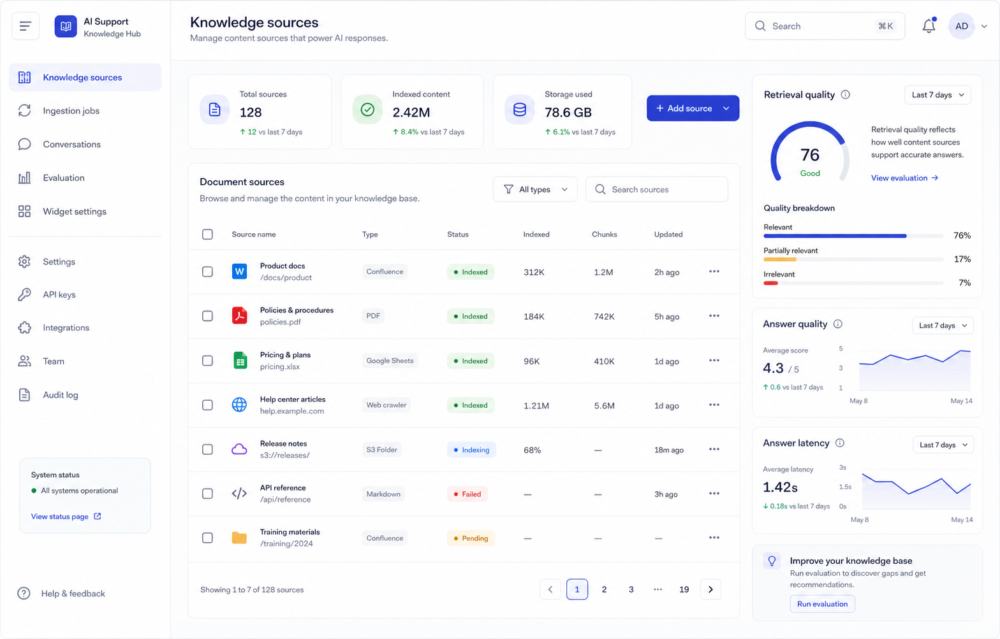
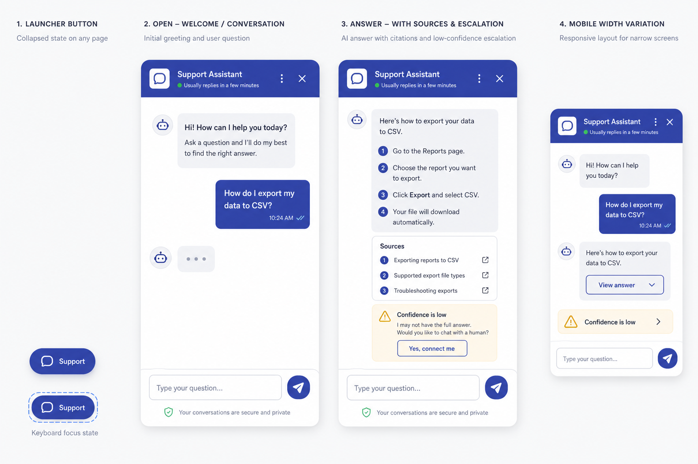

# Product Brief: Production RAG Support Chatbot

## 1. Product summary

Build a production-ready, public customer-support chatbot that companies can embed on their websites. The chatbot answers FAQs, product questions, and support queries strictly from an administrator-managed knowledge base. It provides a fast conversational experience, streamed answers, and clear source citations while declining to invent an answer when the available documentation is insufficient.

The first release serves **one organization and one curated public knowledge base**. It is deliberately an advanced RAG system—hybrid retrieval, reranking, evaluation, and observability—but does not introduce GraphRAG, autonomous agents, billing, or multi-tenant administration before the product has evidence that they are needed. This approach aligns with the [Enterprise RAG Architecture guide](https://www.applied-ai.com/briefings/enterprise-rag-architecture/): hybrid search and reranking are the production baseline, while more elaborate retrieval patterns should be justified by measured need.

### Goals

- Give website visitors grounded, useful support answers with citations.
- Let one authenticated admin team update knowledge without engineering intervention.
- Make content replacement safe: stale document chunks must never remain searchable.
- Provide enough diagnostics, evaluation, and logging to explain poor answers and improve quality over time.
- Operate on managed GCP services with independent scaling for the API and ingestion work.

### Non-goals for v1

- Regulated-domain workflows (healthcare, legal advice, and comparable high-stakes use cases).
- Multi-tenant workspaces, customer billing, granular admin roles, and SSO integrations.
- Full-domain crawling, sitemap discovery, or automatic link following.
- Answers based on live business data, direct third-party API actions, GraphRAG, or autonomous agents.

## 2. Users and primary flows

| User                  | Need                            | Primary flow                                                                                                            |
| --------------------- | ------------------------------- | ----------------------------------------------------------------------------------------------------------------------- |
| Website visitor       | Get a quick, trustworthy answer | Open widget → ask question → receive streamed grounded answer and source links, or a support handoff.                   |
| Administrator         | Keep answers current            | Sign in → upload a document or add an exact public URL → monitor ingestion → re-ingest or replace when content changes. |
| Product/support owner | Improve answer quality          | Review conversations, feedback, retrieval traces, latency, and evaluation results → tune content or prompts.            |

## 3. Product surfaces

### Admin portal

Build the portal in Next.js/React with application-managed email/password (Supabase) authentication. Every authenticated user has the same admin role in v1. The portal provides:

- **Knowledge sources:** upload PDF, TXT, and Markdown files; submit individual public URLs; view source type, version, status, chunk count, tags, and errors.
- **Ingestion jobs:** start, retry, replace, and inspect queued/running/failed/completed work.
- **Widget settings:** configure a public widget key, allowed website domains, welcome text, brand tokens, and support-handoff URL or email.
- **AI providers & model profiles:** securely connect supported LLM providers; create versioned profiles for generation, embeddings, query rewriting, and reranking; compare evaluation, latency, and cost; then promote or roll back a profile.
- **Conversations:** review answer, citations, feedback, latency, and the associated retrieval trace.
- **Evaluation:** manage a curated golden set and view retrieval and answer-quality regression results.



The mockup is visual direction rather than a production screenshot: white/slate surfaces, deep-slate typography, indigo actions, accessible contrast, generous spacing, restrained rounded corners, and visible focus states. The AI Providers area uses the same system: provider connection cards, capability/status badges, a role-by-role model profile editor, an evaluation comparison table, and a clearly labeled **Promote to production** action.

### AI providers and model experimentation

The admin portal must make model experiments safe and observable without exposing credentials:

- **Provider connections:** support Vertex AI by default and external provider adapters such as OpenAI and Anthropic. A connection records provider, project/region or endpoint, supported capabilities, status, and a Secret Manager reference. External API keys are entered over TLS, stored directly in Secret Manager, and never returned to the browser or logs.
- **Model profiles:** each named, versioned profile independently selects a configured provider and model for four roles: answer generation, embeddings, query rewriting, and reranking. It also records timeout, token/context limits, fallback order, and a human-readable change note.
- **Experiment workflow:** an admin clones the current production profile, edits a draft, runs the golden-set evaluation, compares Recall@10, faithfulness, relevance, abstention correctness, p50/p95 latency, error rate, and estimated cost, then promotes the approved profile. Production always points to exactly one active profile; promotion and rollback create an audit event and do not alter an in-flight chat request.
- **Embedding safeguard:** changing the embedding provider or model creates a separate re-index plan. The UI shows the affected source count and estimated work, requires confirmation, and keeps the previous production profile active until re-indexing and evaluation complete successfully. Generation, rewrite, and reranker-only changes do not trigger re-indexing.
- **Capability validation:** the API rejects a profile that selects a model which cannot perform its assigned role, has an unavailable secret, or exceeds the allowed timeout/cost limits. Provider changes are also tested with a server-side health check before an evaluation can run.

Admin APIs support this interface under authenticated `/admin/ai/providers`, `/admin/ai/model-profiles`, `/admin/ai/model-profiles/{id}/evaluate`, and `/admin/ai/model-profiles/{id}/promote` routes. The public chat API continues to receive only a widget key and always resolves the active production profile server-side.

### Embeddable chat widget

Ship the widget as a versioned, script-loaded React custom element with Shadow DOM style isolation—not an iframe. Customers embed it with a script and element such as:

```html
<script src="https://cdn.example.com/support-widget/v1.js" defer></script>
<support-chat widget-key="public_widget_key"></support-chat>
```

The widget validates its host origin against the configured allowed-domain list. It supports a collapsed launcher, keyboard navigation, responsive/mobile layout, streamed messages, source citations, and a low-confidence support-handoff state. It must not expose admin credentials or private retrieval data.



## 4. Architecture and data lifecycle

### GCP deployment

| Concern                                            | Service / responsibility                                               |
| -------------------------------------------------- | ---------------------------------------------------------------------- |
| Public chat API and admin backend                  | FastAPI on Cloud Run                                                   |
| Admin portal                                       | Next.js on Cloud Run                                                   |
| Ingestion worker                                   | Cloud Run worker service invoked through Cloud Tasks                   |
| Raw documents                                      | Cloud Storage                                                          |
| Source manifest, chunks, logs, and evaluation data | Cloud SQL for PostgreSQL with pgvector and PostgreSQL full-text search |
| Secrets                                            | Secret Manager                                                         |
| Logs, metrics, traces, alerts                      | Cloud Logging and Cloud Monitoring                                     |
| Public delivery                                    | HTTPS load balancer and CDN                                            |

Use Vertex AI as the initial provider behind provider interfaces for generation, embeddings, query rewriting, and reranking. Provider connections and model profiles are admin-configured, versioned product data rather than application business logic; API secrets remain in Secret Manager.

### Source and ingestion rules

Only these sources are supported in v1: uploaded PDF, TXT, and Markdown files, plus exact public URLs manually supplied by an administrator. The URL importer fetches only the supplied page; it does not crawl linked pages, domains, or sitemaps.

Each source receives a stable `doc_id` and has a relational manifest containing source location, current version, content hash, ingestion status, metadata, and its generated chunk IDs. A replace/re-ingest job is idempotent:

1. Create a new source version and enqueue an ingestion task.
2. Extract, normalize, classify, and validate content.
3. Delete all chunks belonging to the prior active version of the same `doc_id`.
4. Generate, embed, and persist the new chunks and manifest references atomically where possible.
5. Mark the new version active only after indexing succeeds; preserve the failure reason otherwise.

This lifecycle prevents old content from surviving an update. Jobs are retryable with exponential backoff and a bounded retry count; failures are visible in the portal.

### Parsing, chunking, and metadata

Chunk by document structure instead of a global fixed-size splitter:

- **Prose:** preserve paragraph and section boundaries; target 300–600 tokens with 10–15% overlap.
- **Tables and key/value content:** make each row or record a separate chunk, prefixed with its headers or key names.
- **Hierarchical manuals:** create small child chunks for retrieval and retain a parent section for generation context.

Every chunk stores its `chunk_id`, `doc_id`, source version, source URL/object key, page number or section heading, document category/tags, creation time, token count, parent ID when applicable, full-text representation, and embedding. This supports filtering, citations, traceability, and clean deletion.

## 5. Retrieval and answer delivery

The public streaming endpoint is:

```http
POST /v1/chat/stream
```

The request contains a public widget key, visitor session ID, the short conversation history, and the current question. The endpoint returns Server-Sent Events for answer deltas, citations, and a final completion/error event.

For each question, the service:

1. Validates the widget key, allowed origin, schema, rate limits, and input size.
2. Uses a lightweight model to correct obvious spelling, expand abbreviations, and produce up to three query variants.
3. Runs dense pgvector retrieval and PostgreSQL lexical/full-text retrieval in parallel, applies required source filters, and merges lists with Reciprocal Rank Fusion.
4. Reranks the top 30 fused results using a cross-encoder.
5. Selects the best 3–5 results within a 2,000-token context budget. If needed, apply targeted context compression rather than crowding the prompt.
6. Streams a grounded answer from the generation model, using only approved context and returning document/page or heading citations.

Keep only a short, bounded conversation window sufficient for follow-up questions. When evidence quality is below the configured threshold, return a clear abstention and the configured support-handoff path rather than a model-general answer.

## 6. Reliability, security, and operations

- Use async FastAPI routes, pooled database connections, request timeout budgets, retry-with-backoff, circuit breakers, and provider fallback configuration.
- Enforce HTTPS, allowed-origin CORS, signed/admin-only source actions, hashed passwords, Secret Manager secrets, least-privilege service accounts, input-size limits, and per-widget/IP rate limits.
- Emit structured logs and traces for request ID, widget ID, query, rewritten variants, retrieved chunk IDs, rank/reranker scores, selected citations, model and token usage, cost estimate, each pipeline stage latency, final state, errors, and visitor feedback.
- Attach the active provider connection ID and model-profile version to every trace, evaluation run, promotion, rollback, and ingestion/re-index job so results remain comparable and auditable.
- Define latency and cost dashboards with p50/p95 targets, alerts for failed ingestion, provider errors, elevated abstention, and retrieval-quality regression.

## 7. Evaluation and release quality

Create a golden set of 50–100 representative questions with expected answers and manually annotated supporting chunks. Run it in CI and before deployment. Measure:

- Recall@10: whether a supporting chunk appears in the top ten retrieval results.
- Faithfulness: whether the answer is fully supported by supplied context.
- Relevance: whether the answer addresses the visitor question.
- Abstention correctness for unsupported questions.
- Citation coverage, p50/p95 latency, error rate, and cost per completed answer.

An approved baseline is established before launch. A model-profile promotion is blocked if any core quality metric regresses by more than 5% from the current production baseline; failed or degraded evaluations are visible to administrators along with the tested provider and model versions.

## 8. Acceptance scenarios

- A PDF, TXT, Markdown file, and manually supplied public URL each ingest successfully and are searchable with source citations.
- Replacing a document removes every chunk from its prior source version before the new version becomes active.
- Exact product codes, paraphrases, misspellings, compound questions, and follow-up questions retrieve useful evidence; unsupported requests abstain and provide a support handoff.
- The widget streams on an approved domain, is keyboard and screen-reader usable, and rejects unapproved origins.
- An administrator can create a draft profile using a configured provider, evaluate it against the golden set, compare it to production, promote it, and roll it back. Secrets are never visible after entry.
- Changing only generation, query-rewrite, or reranker models does not re-index the corpus; changing embeddings requires explicit confirmation, a completed re-index, and a passing evaluation before promotion.
- Concurrent requests and dependency failures observe timeout, retry, rate-limit, and logging behavior without leaking sensitive data.
- Every release runs the golden set and rejects a material quality regression.

## 9. Maintenance responsibilities

Administrators should review failed ingestion jobs, conversation feedback, poor-answer traces, source freshness, provider health, model-profile evaluations, and cost trends regularly. Engineering owns the approved provider adapters, role capability rules, retrieval-threshold calibration, dependency updates, dashboards, access review, backup/restore testing, and periodic capacity review as the corpus approaches the practical limits of the initial PostgreSQL/pgvector deployment.
